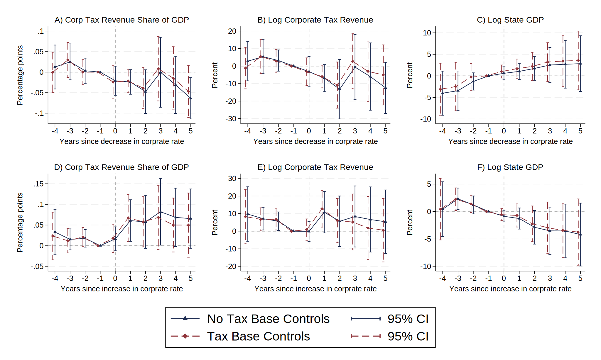

# Replication of [Serrato & Zidar (2018)](https://doi.org/10.1016/j.jpubeco.2018.09.006)
The first time I read [Serrato & Zidar (2018)](https://doi.org/10.1016/j.jpubeco.2018.09.006) is in 2021 (my first year in my Master program), and it became the first empirical Econometrics paper impressing me. Here I just share my Stata coding files that *partially* replicate this paper.

To run my codes, the following packages should be installed in advance.
```stata
ssc install listtex, replace
ssc install estout, replace
ssc install regsave, replace
ssc install cdfplot, replace
net install grc1leg, replace from(http://www.stata.com/users/vwiggins/)
```

## Purpose of Research
* Describe the US state corporate tax structure and document how it has changed over time.
* Investigate the consequences of these changes for state tax collections and economic activity.

## Main Findings
* Tax base rules and credits explain more of the variation in state corporate tax revenues than tax rates do.
  * As the data (50 states in 1980-2010) show, while average state corporate tax rates have remained relatively stable, tax base and credit changes are much more frequent, and state corporate tax revenues as a share of economic activity have declined substantially.
  * The vast majority of tax base changes aren't associated with tax rate changes.
* Although states typically don't offset tax rate changes with base and credit changes, the effects of tax rate changes on tax revenue and economic activity depend on the breadth of the base.
* As states have narrowed their tax bases, the relationship between tax rates and tax revenues has diminishes.

## Event Study Estimation
To do an analysis of the path of state outcomes preceding and following a change in the state corporate tax structure, the authors used the following **event study** specification:
$$R_{st} = \alpha_s + \gamma_t + \sum_{k \in \\{-4,-3,-2,0,1,2,3,4,5\\}} \beta_k D_{st}^k + \beta \sum_{k<-4} D_{st}^k + \bar{\beta} \sum_{k>5} D_{st}^k + \varepsilon_{st}$$
where
* $R_{st}$ denotes the state-year outcome variables, including state corporate tax revenue as a share of state GDP, log state corporate tax revenue, and log state GDP;
* $D_{st}^k$ is an indicator for state $s$ having changed the state tax rate $k$ periods in the past;
* $\alpha_s$ is state fixed effect, and $\gamma_t$ is time fixed effect.

The authors addressed imbalance issues by binning periods greater than 5 or less than -4. To address serial correlation in $\varepsilon_{st}$, all standard errors are clustered at state level. See [Figure7.do](https://github.com/IanHo2019/State_Tax_SZ2018/blob/main/Figure7_Event_Study.do) for coding details.

**Event study results:**
* Corporate tax decreases that exceed 0.5 pp cuts in the rate tend to reduce state corporate tax revenue as a share of state GDP by roughly 6 pp cumulatively over a 5-year period. 
* Controlling for tax base rules doesn't strongly affect the estimated effects.



## Regression Estimation and Heterogeneous Effects
To increase statistical precision, the authors run a new regression:
$$R_{st} = \alpha_s + \phi_t + \gamma \tau_{st} + \boldsymbol{\rm X}_ {st}' \boldsymbol{\Psi}_ {st}^{BASE} + u_{st}$$
where $\tau_{st}$ denotes the state corporate tax rates, and $\boldsymbol{\rm X}_{st}$ is a vector of tax base controls. This model derives from a first-order approximation of the state corporate tax revenue function around $(\tau^\*,X^\*)$. See footnote 16 in the paper for information, and see [Table5.do](https://github.com/IanHo2019/State_Tax_SZ2018/blob/main/Figure5_Var_Decomp.do) for regression coding.

Considering that changes in state corporate tax rates may have different effects on tax revenue and economic activities depending on the breadth of the tax base, then the authors expanded the model above by including interaction terms between the tax rate and the tax base controls:
$$R_{st} = \alpha_s + \gamma_t + \beta_0 \tau_{st} + \sum_{j=1}^{15} \beta_j \tau_{st} \times \tilde{\chi}_ {st}^{j} + \boldsymbol{\rm X}_ {st}^{'} \boldsymbol{\rm \Psi}_ {st}^{BASE} + u_{st}$$
where $\tilde{\chi}^{j}$ is the standardized base rules, which facilitate the interpretation of $\beta_0$ as the mean effect of state corporate tax rates ($\tau$). See [Table6.do](https://github.com/IanHo2019/State_Tax_SZ2018/blob/main/Figure6_Var_Decomp_over_Time.do) for coding details.

Including those interaction terms led to a much higher estimated effect of tax rate on the revenue-to-GDP ratio, highly suggesting the former OLS regression returned a biased estimate.

## Revenue-Maximizing Tax Rate
Introducing a quadratic term to the basic framework gives us
$$R_{st} = \beta_0 \tau_{st} + \delta_0 \tau_{st}^2 + \alpha_s + \gamma_t + u_{st}$$
By the first-order condition, we can obtain the revenue-maximizing tax rate
$$\tau^* = \frac{\beta_0}{-2\delta_0} \quad \text{if}\ \delta_0 < 0$$
The authors used this equation and its updated version (allowing the linear and quadratic effects of $\tau$ to depend on base index[^1]) to estimate the revenue-maximizing tax rate. Interestingly, they found that the minimum revenue-maximizing tax rate is even greater than any corporate tax rate observed in their data.

[^1]: Base index is an authors-defined index of the breadth of the tax base. See Section 4.2.1 and [Table 5.do](https://github.com/IanHo2019/State_Tax_SZ2018/blob/main/Table5_Regression_Results.do) for computation details.
